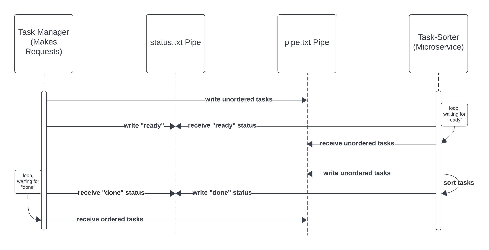

# Task Sorter

This is a script that sorts tasks. I created this as a mircoservice for my parter in Software Engineering 1. The script uses a text file as a pipe to communicate with my partner's program.

## Pipe Requirements
- Two files called `status.txt` and `pipe.txt` must be present in the same directory as this microservice.

## Requesting Data
To request data from this microservice, follow these steps in order:
1. Ensure that this microservice is running.
2. Write the unordered tasks to `pipe.txt` using this [request format](#format-of-requests).
3. Write `ready` to `status.txt`.

This is a successful call. From here, the mircorservice will read in the tasks from `pipe.txt` and order them.

## Receiving Data
To receive data from this microservice, follow these steps in order:
1. Make a request following the [steps above](#requesting-data).
2. Wait until `status.txt` contains `done`.
3. Read in the ordered tasks from `pipe.txt`, which are in this [response format](#format-of-responses).

## Example Call and Request Timeline
| Task Manager Software                            	| Task-Sorter Microservice 	|
|--------------------------------------------------	|--------------------------	|
| 1. Writes list of unordered tasks to `pipe.txt`  	|                          	|
| 2. Writes `ready` to `status.txt`                	|                          	|
|                                                  	| 3. Orders tasks          	|
| 4. Wait until `status.txt` contains `done`       	|                          	|
| 5. Read in list of ordered tasks from `pipe.txt` 	|                          	|

## UML Sequence Diagram


## Task Data Format

### Format of Requests
This microservice expects an array of JSON objects to be  inserted into `pipe.txt`. Each object should represent a task. The array can be all in one line, or formatted in other ways like the example below. 

Each JSON object can have any attributes necessary to the task manager software using this microservice. The only requirement is that each task object has a `do` attribute which represents when to <strong>do</strong> the task.
- The `do` attribute must be the string representation of a JavaScript `Date` object.
  - For more information on this format, see the MDN documentation [here](https://developer.mozilla.org/en-US/docs/Web/JavaScript/Reference/Global_Objects/Date#date_time_string_format).

Below is an example of the format of the unordered tasks to be written to `pipe.txt`. Any number of tasks can be written to `pipe.txt`, and tasks can have additional attributes other than `do`.
```json
[
    {        
        "do": "YYYY-MM-DD",        
    },
    {        
        "do": "YYYY-MM-DD",        
    },
    {        
        "do": "YYYY-MM-DD",        
    }
]
```

### Format of Responses
Once this microservice has ordered the tasks, it will write the ordered tasks back to `pipe.txt`. The tasks will once again be in the format of a JSON array, with each object representing a task.

The ordered tasks will be in one line in `pipe.txt`, and an example is as follows, with other attributes and tasks as necessary:
```json
[{"do": "YYYY-MM-DD"},{"do": "YYYY-MM-DD"},{"do": "YYYY-MM-DD"}]
```